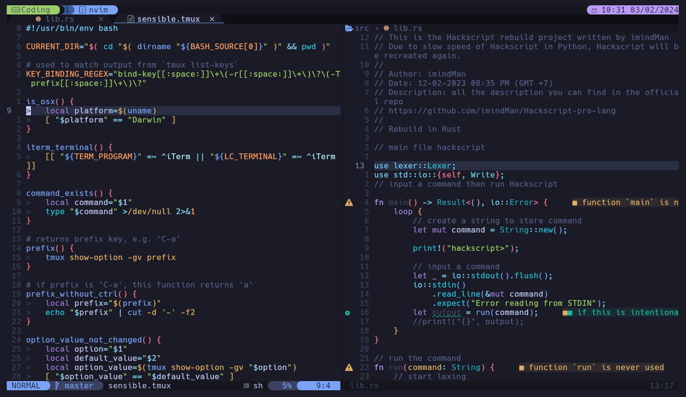

<h1> TMUX TOKYO NIGHT BAR </h1>

A heavy fork of [fabioluciano/tmux-tokyo-night](https://github.com/fabioluciano/tmux-tokyo-night) to fit my own style.

Preview:

<h1> INSTALLATION </h1>

Under tpm, you can use this command to install in `tmux.conf`.

`set -g @plugin 'imindMan/imindtmux-tokyo-night' `

Hit <kbd>prefix</kbd> + <kbd>I</kbd> to fetch the plugin and source it. You can now use the plugin.

<h1> INSPIRATION </h1>

I am absolutely a fan of fabioluciano tokyo-night bar, since he has the only best tokyo-night bar that really fits my style. But, I have to change some stuff to get it really fits me.
